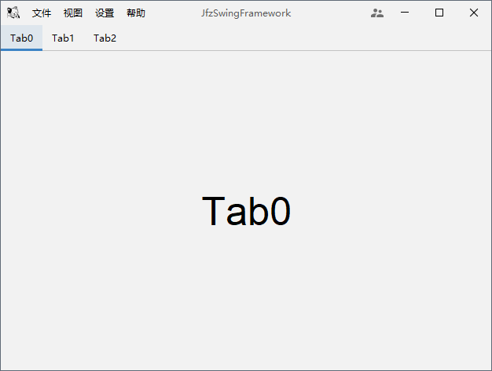

# Jfz Swing Framework
异想家Java Swing应用框架底座

### 简介

自己学习Java Swing时想到的一个点子，做一个Swing程序的底座，之后新功能都往里塞就行了。可能有类似的Swing框架程序，但是没研究过、没调查过，本项目完全是自己想到什么就怎么来，Bug和安全问题可能很多，仅适合当玩具折腾，欢迎贡献代码和idea。

### 特点

- [x] 基本界面、FlatLaf主题框架
- [x] 更换主题
- [x] 关于
- [ ] 配置功能(基本设置、导入导出)
- [ ] 状态栏
- [ ] 国际化
- [ ] 插件框架
- [ ] 更新框架
- [ ] Win启动器

### 更新

#### 2022-04-30

重新拾起项目，基于FlatLaf构建主题，插件式开发框架

#### 2020-08-19

开启项目

